# AnyCAD Rapid .NET Sample

## 分支说明:
 - R2021: 2021 branch
 - R2022: Master branch

## 1 环境准备

### 1.1 Microsoft Visual C++ Runtime Library

Download link: 
- [vc_redist.x64](https://aka.ms/vs/17/release/vc_redist.x64.exe)
- [vc_redist.x86](https://aka.ms/vs/17/release/vc_redist.x86.exe)

### 1.2 .Net Framework 4.8
### 1.3 .Net 6.0

## 2 程序示例

### 2.1 建模

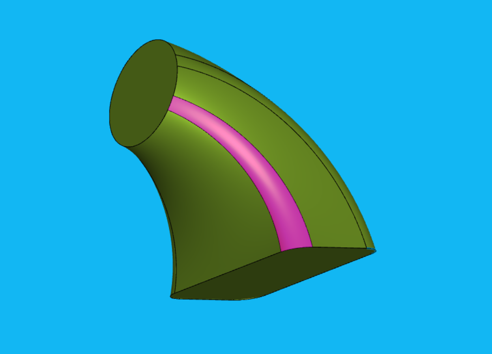

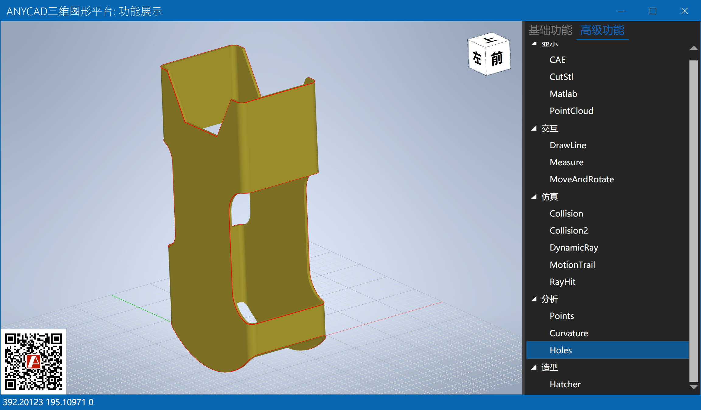

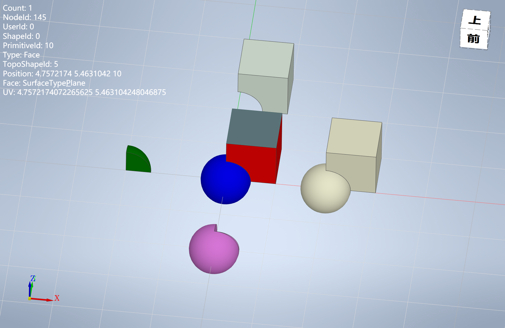

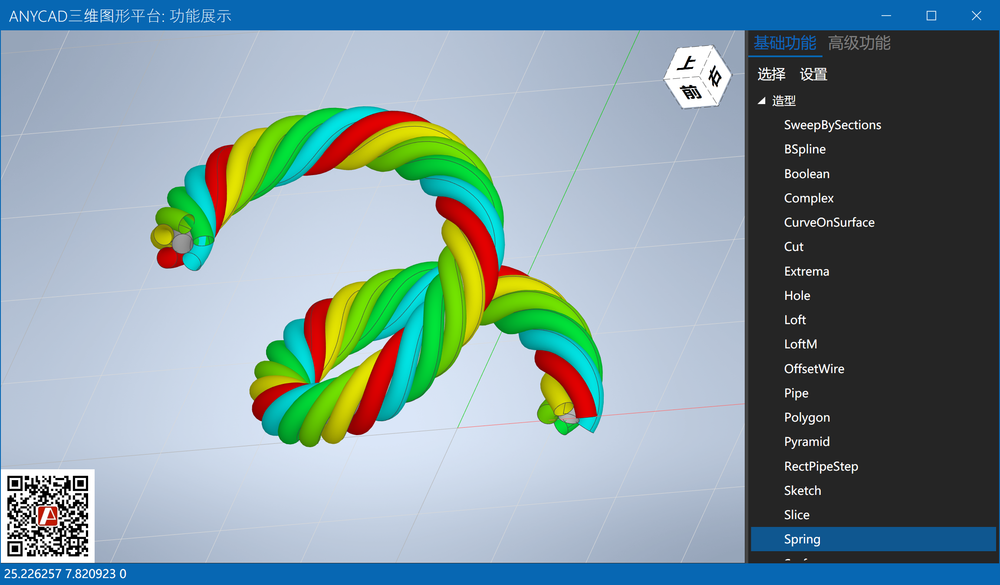

### 2.2 显示

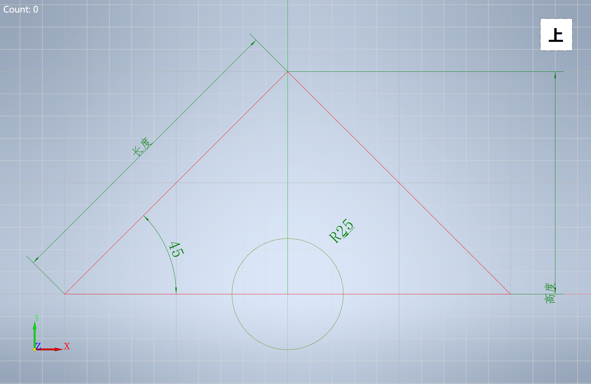

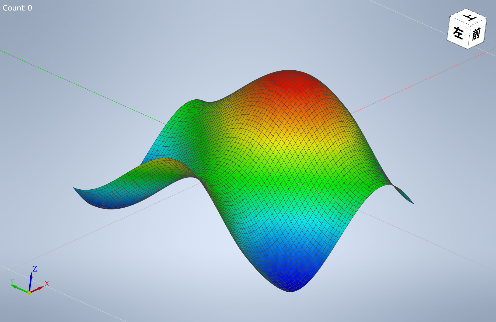

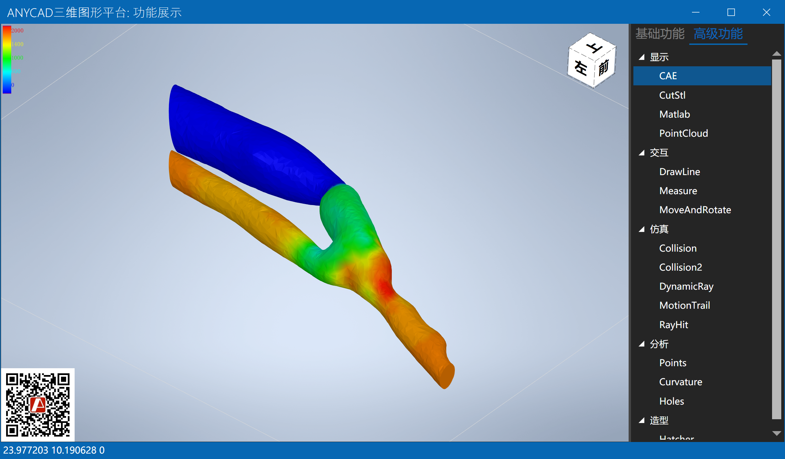

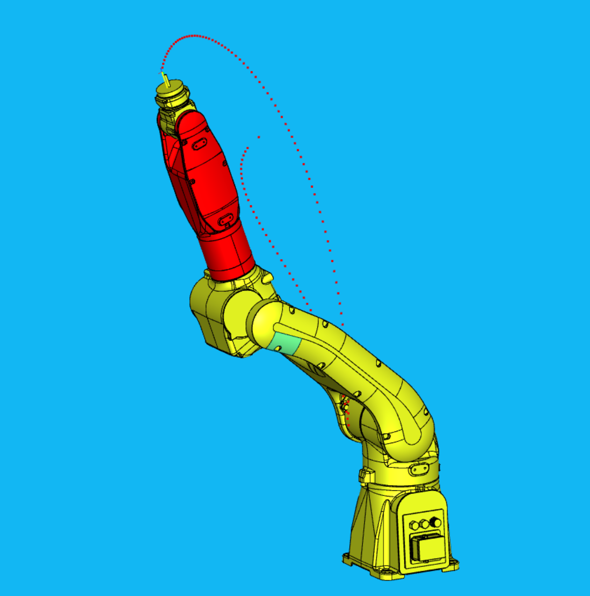

### 2.3 交互
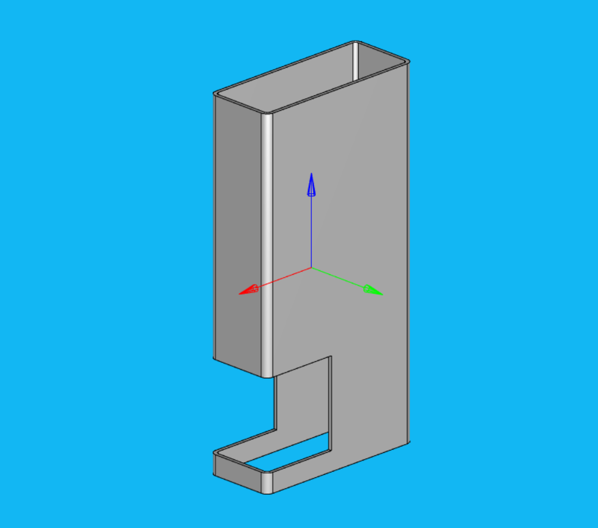
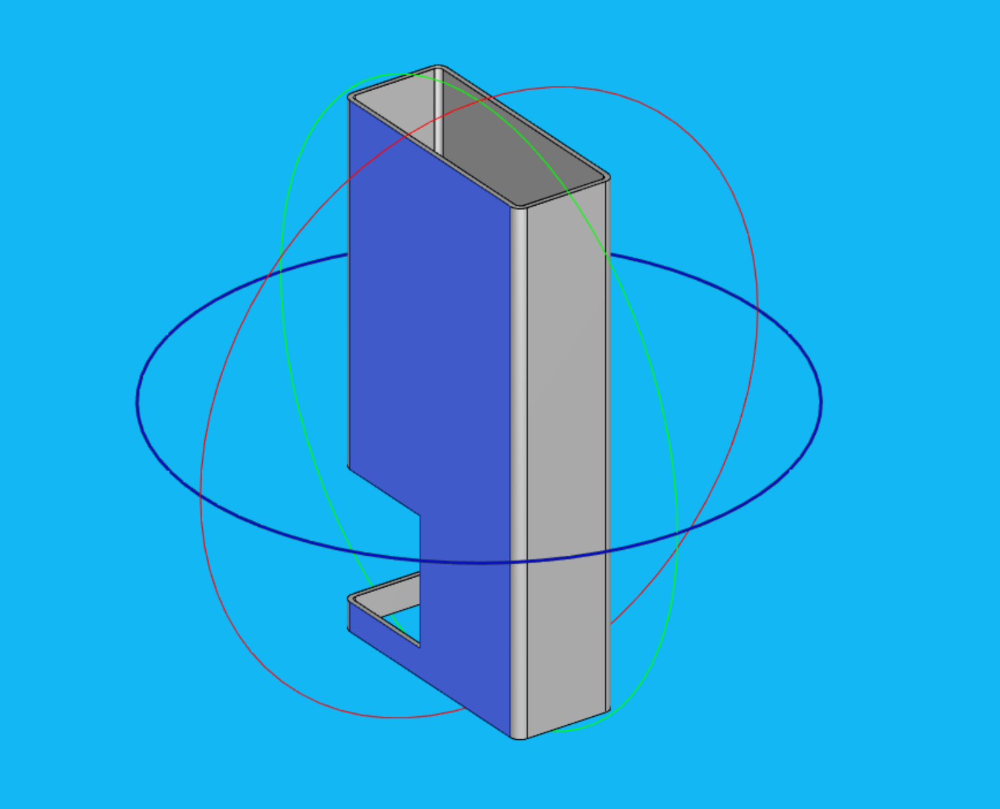

### 2.4 Featured App
[Robot.NET](https://gitee.com/anycad/anycad.rapid.net.sample/AnyRobot.NET)
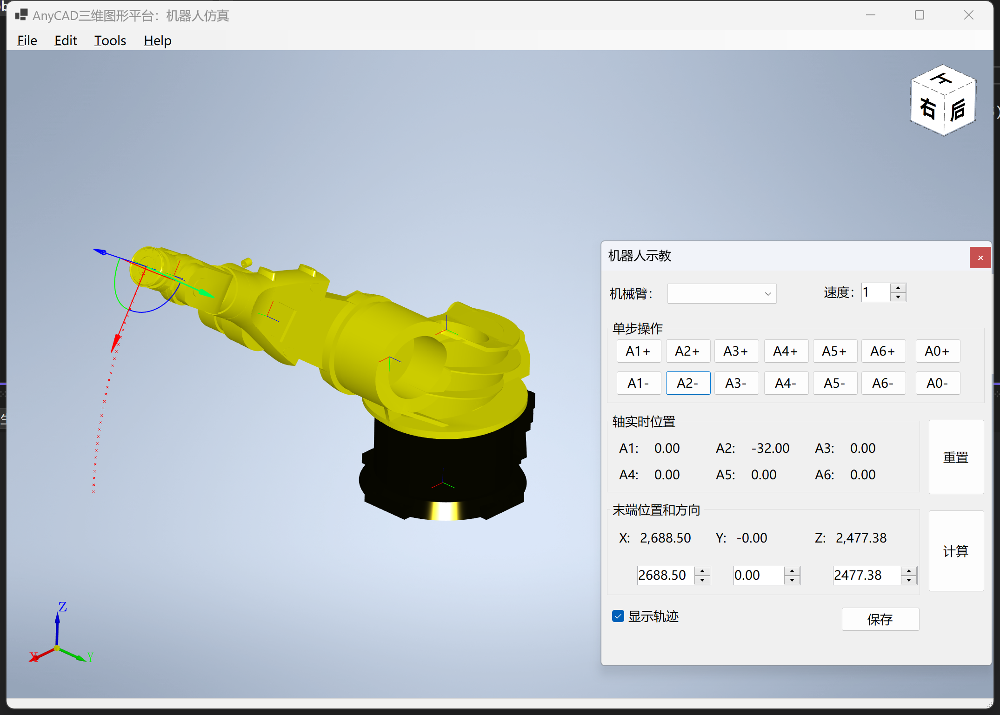

## 3 Documentation

- [API](http://www.anycad.cn/api/classes.html)
- [Guide](http://www.anycad.cn/guide/)

## 4 更多示例
### 入门示例：
https://gitee.com/anycad/rapid.net.starter
### 高级示例：
https://gitee.com/anycad/RapidCAX

## 5 关于
http://www.anycad.cn

