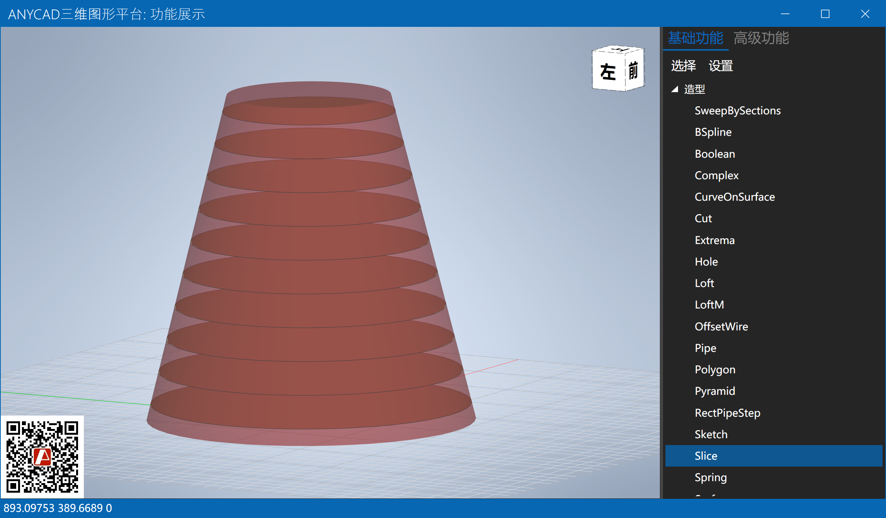
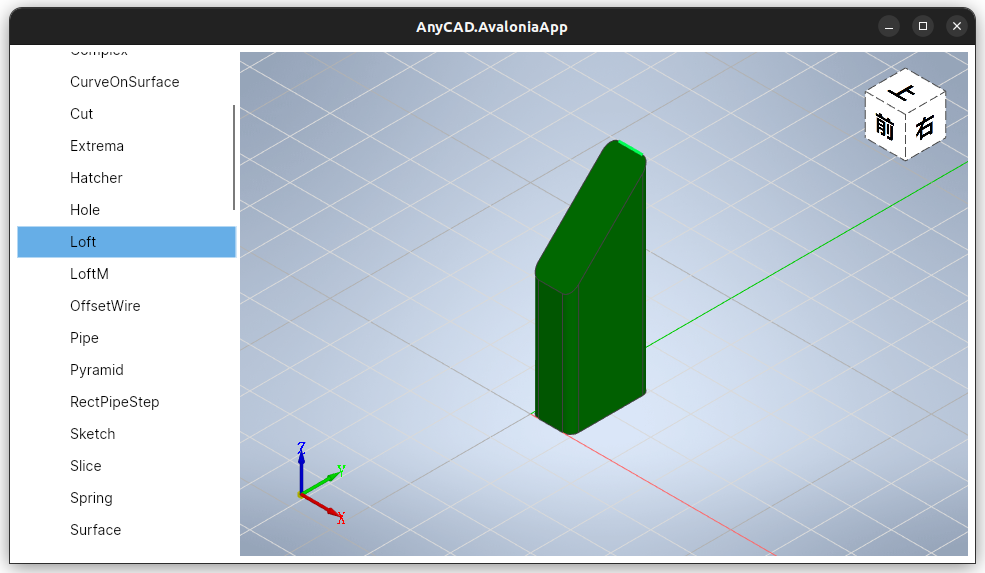
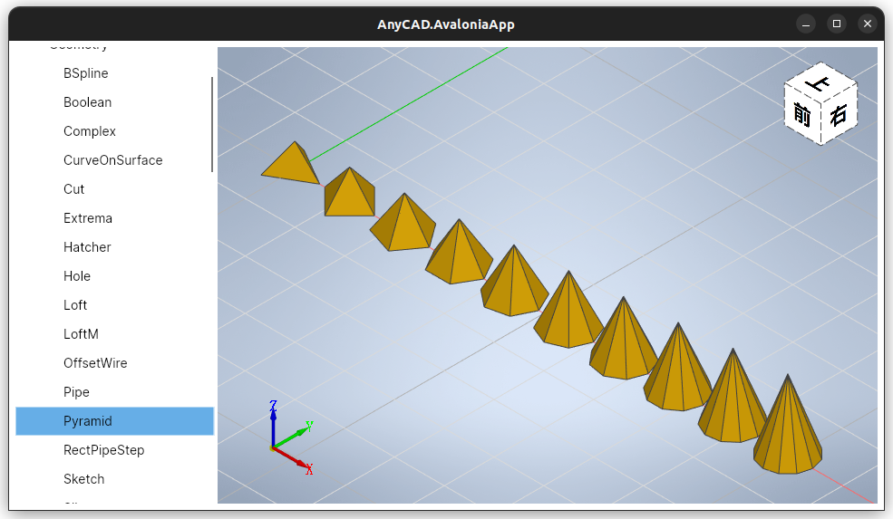
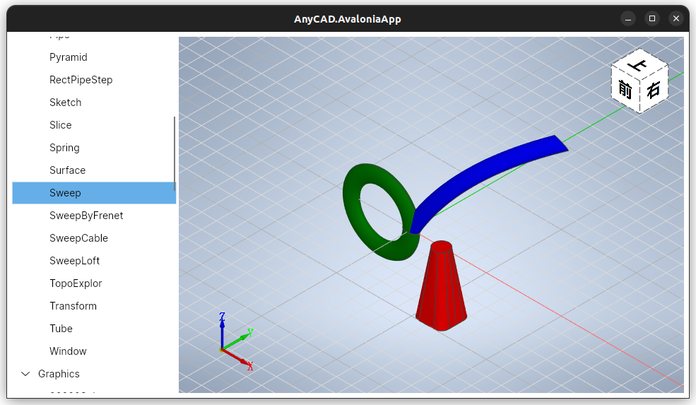

# AnyCAD Rapid .NET Sample

本代码仓库包含包含基础功能和高级功能的演示。其中，
- 基础功能：位于AnyCAD.Basic工程中
- 高级功能：位于AnyCAD.Advanced工程中。

界面可以选用WinForms、WPF、AvaloniaUI，分别对应不同的App程序。

## 0 分支说明:
 - R2021: 2021 branch
 - R2022: 2022 branch
 - R2023: master

## 1 环境准备

### 1.1 Windows
#### 1.1.1 Microsoft Visual C++ Runtime Library

低于VS2022的版本需要下载C++运行时库，下载地址: 
- [vc_redist.x64](https://aka.ms/vs/17/release/vc_redist.x64.exe)
- [vc_redist.x86](https://aka.ms/vs/17/release/vc_redist.x86.exe)

#### 1.2.2 .NET Framework
支持 .Net Framework 4.5.2、4.8
#### 1.3.2 .NET 6.0
推荐使用.NET 6.0

### 1.2 Linux
### 1.2.1 .NET 6.0
```
sudo apt-get update && \
  sudo apt-get install -y dotnet-sdk-6.0
```
### 1.2.2 编译
```
dotnet msbuild AnyCAD.Rapid.Avalonia.sln
```
## 2 程序示例

### 2.1 建模





### 2.2 显示


### 2.3 交互


### 2.4 跨平台Linux






### 2.4 Featured App
[Robot.NET](https://gitee.com/anycad/anycad.rapid.net.sample/AnyRobot.NET)


## 3 Documentation

- [入门说明](http://www.anycad.cn/guide/)
- [API手册](http://www.anycad.cn/api/classes.html)

## 4 更多示例
### 入门示例：
https://gitee.com/anycad/rapid.net.starter
### 高级示例：
https://gitee.com/anycad/RapidCAX

## 5 关于
http://www.anycad.cn

